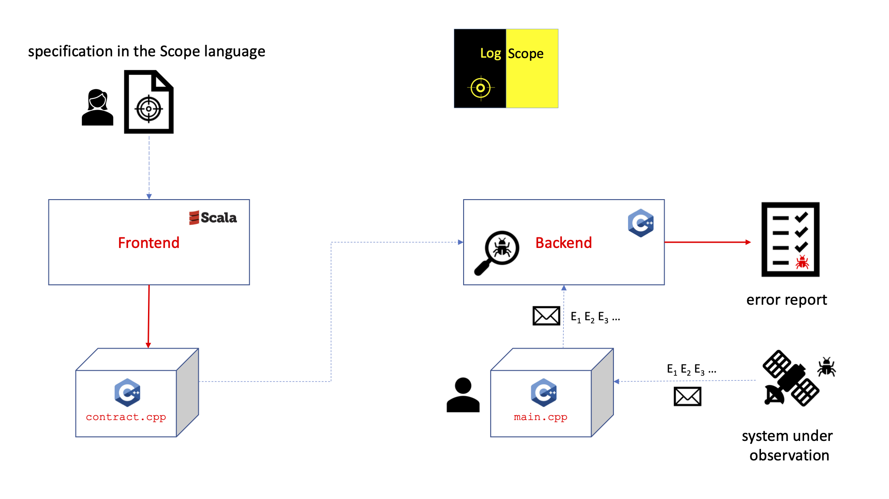

# LogScope

LogScope supports analysis of event streams. The tool takes as input a specification of the properties that an event stream must satisfy,
as well as an event stream, and produces as output a report on violations of the specification. LogScope can be applied
in <em>online</em> mode, monitoring an application as it executes, or offline, reading the event stream from a log file. During online monitoring of a C or C++ application, feedback to the monitored application is feasible as the monitoring engine is implemented in C++.

## Specification Language

The Logscope Specification Language merges rule-based programming with state machines. An example specification is the following, stating that every command (the name of which is here bound to the variable <code>x</code>) must eventually succeed, without a failure before.

```
monitor CommandsMustSucceed {
  always {
    COMMAND(name : x) => RequireSuccess(x)
  }

  hot RequireSuccess(cmdName) {
    FAIL(name : cmdName) => error
    SUCCESS(name : cmdName) => ok
  }
}
```

## Architecture

The following figure presents the architecture of LogScope.



The monitor specifications, written in the Scope specification language by a user, is by the frontend
(written in the Scala programming language) translated into C++, stored in the file `contract.cpp`. The backend compiles with the `contract.cpp` file, as well as with a main program in the `main.cpp` file, also written by a user. This main program is responsible for obtaining events E1, E2, ... from the system under observation,  and forwarding them to the backend, which then monitors them using the contract in `contract.cpp`.

Each monitor in `contract.cpp` maintains an internal memory, called the frontier, which is a set of active states. The frontier of a monitor can contain more than one state, each parameterized with its own data, which is one difference from traditional state machines, increasing the expressiveness and convenience of the language. A state can have transitions out of the state, which can delete states, create new states, and/or issue error messages to a report. For each incoming event Ei, a monitor conceptually applies the event to each of its states in the frontier having an interest in the event.

## Manual and Instructions


A user manual can be found [here](https://github.com/logscope/frontend/blob/main/logscope_manual.pdf). 

General instructions for installation and use are described in the manual, as well as in the `README.md` files in the frontend and backend repositories.

An [earlier version](https://github.com/havelund/logscope) of LogScope was implemented in Python around 2008.
 